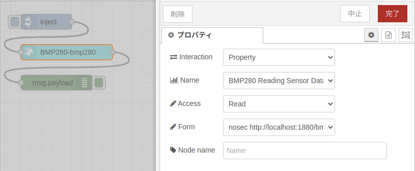

# 気圧センサー BMP280

[BOSCH 気圧センサー BMP280](https://www.bosch-sensortec.com/products/environmental-sensors/pressure-sensors/bmp280/) のための Thing です。
Node-RED とノードモジュール [node-red-contrib-bme280](https://www.npmjs.com/package/node-red-contrib-bme280) を使用します。

### 必要なもの
- ハードウェア
  - Raspberry Pi 3以降
  - [BOSCH 気圧センサー BMP280](https://www.bosch-sensortec.com/products/environmental-sensors/pressure-sensors/bmp280/)
  - ジャンパワイヤ、ブレッドボードなど
- ソフトウェア
  - [Node-RED v2.0 以降](https://nodered.org/)
  - [BME280制御用ノードモジュール (node-red-contrib-bme280)](https://flows.nodered.org/node/node-red-contrib-bme280)
  - [Node Generator (node-red-nodegen)](https://github.com/node-red/node-red-nodegen)

## 配線図

I<sup>2</sup>C を利用して下記の図のように接続します。


## インストール方法

ノードモジュール `node-red-contrib-bme280` を検索し、[パレットにノードを追加します](https://nodered.jp/docs/user-guide/runtime/adding-nodes)。

## フローの作成


<details>
<summary>フローを表示</summary>

下記のフローを[インポートします](https://nodered.jp/docs/user-guide/editor/workspace/import-export)。

[flow.json](flow.json ':include')

</details>

## Thing Description の例

スキーム・ホスト名・ポート番号 `http://localhost:1880` を自分の使っているアドレスに置き換えて使用します。

[bmp280.jsonld](bmp280.jsonld ':include')

Thing Description をダウンロード:

```sh
curl -sLO https://raw.githubusercontent.com/w3c/wot-jp-cg/main/docs/examples/bmp280/bmp280.jsonld
editor bmp280.jsonld
```

## 使用例

上記の Thing Description の例を元にして JSON-LD ファイルを作成し、[node-red-nodegen](https://github.com/node-red/node-red-nodegen) を使用してノードモジュールを作成します。

ノードを作成:

```sh
npx node-red-nodegen bmp280.jsonld
npm --prefix ~/.node-red install ./node-red-contrib-wotbmp280
```


